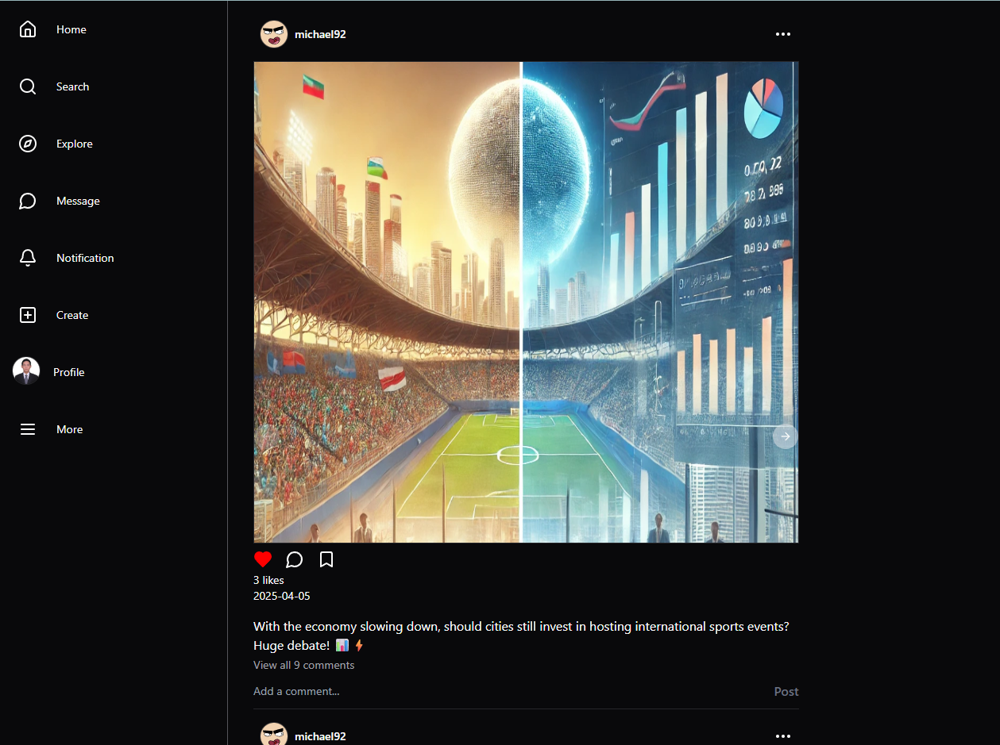
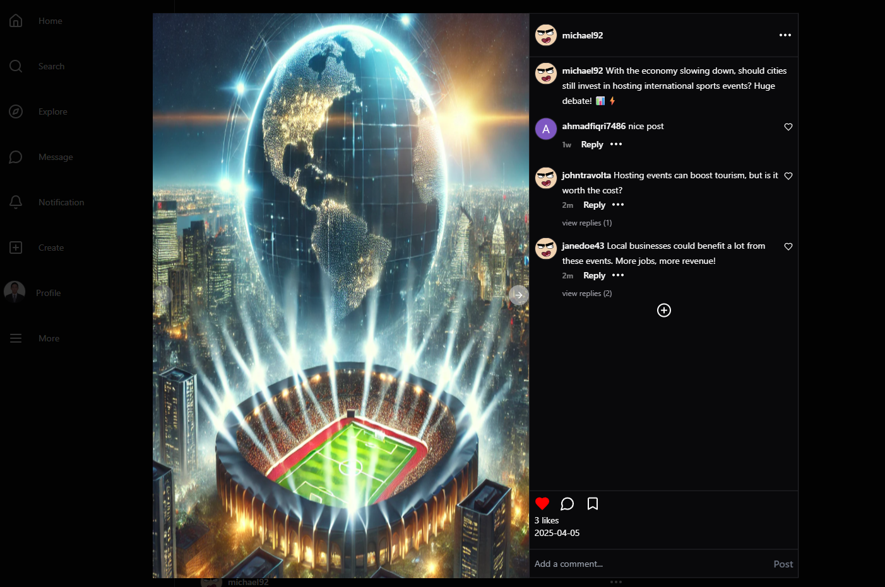
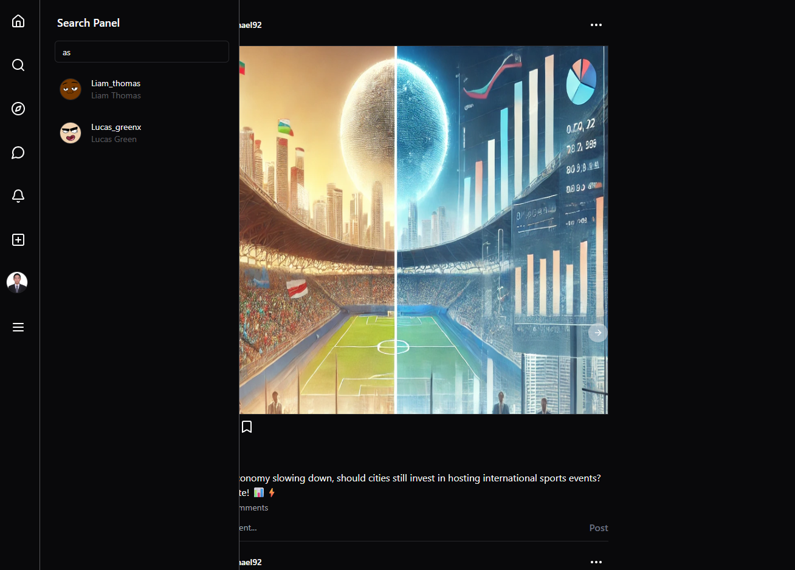
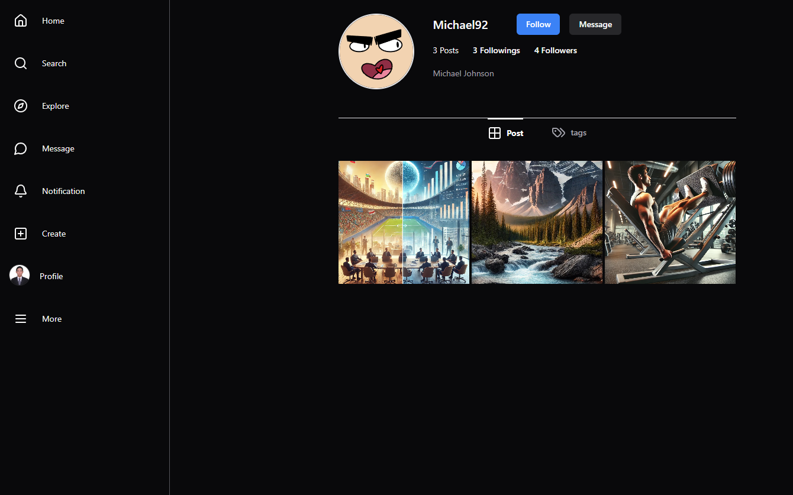
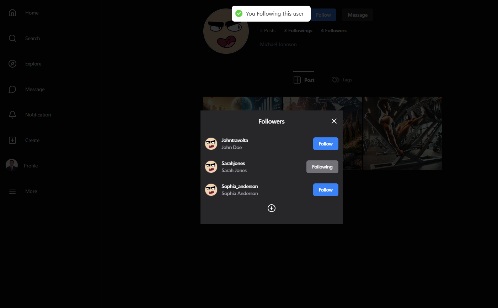
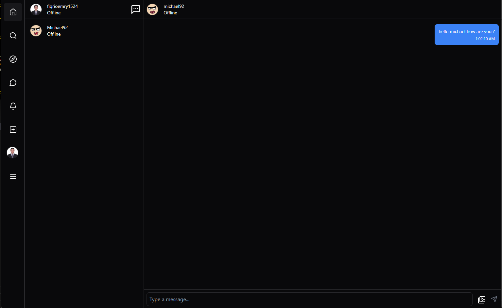
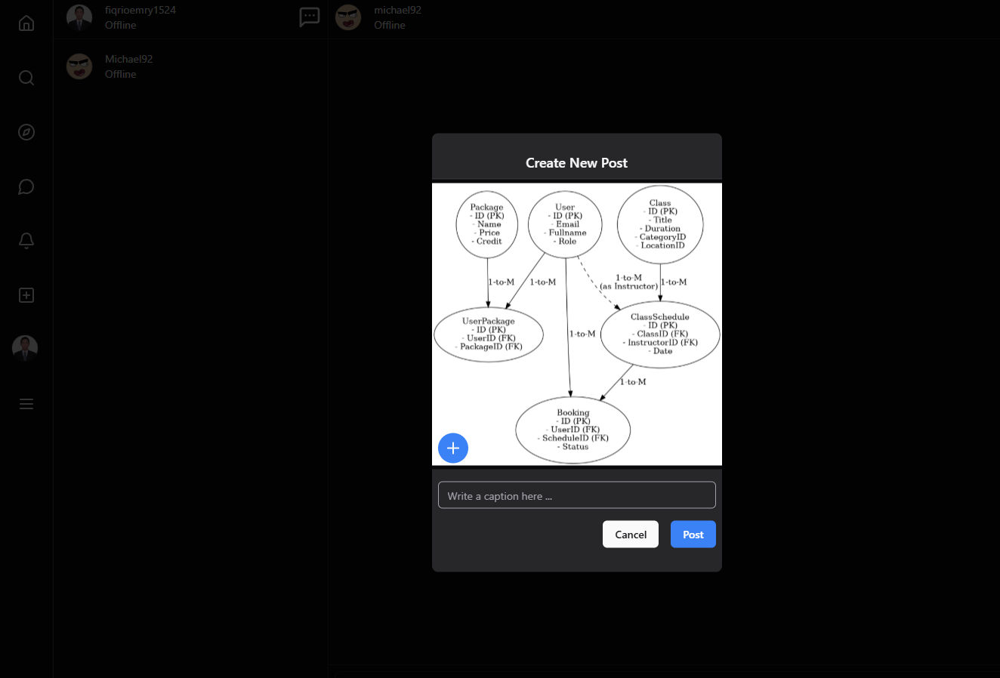
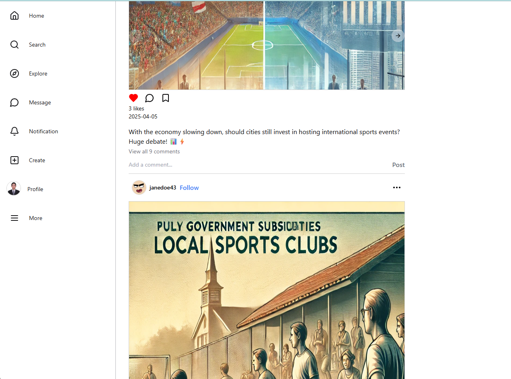
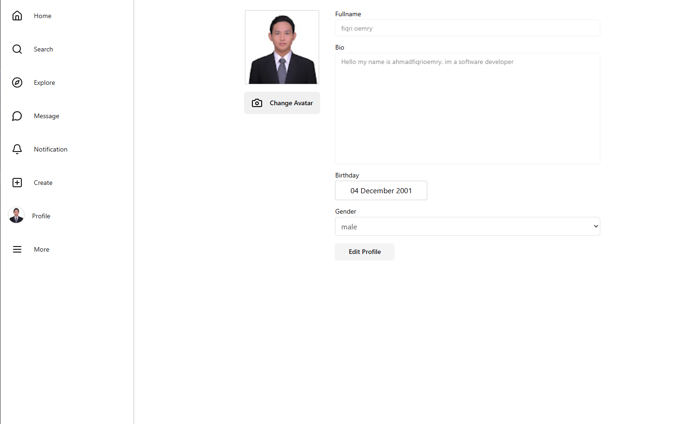

# 📷 Instagram Clone – Fullstack Web Application

Instagram Clone is a fullstack social media web application designed to replicate core features of Instagram. It enables users to create and interact with posts, follow other users, and send real-time chat messages. Built with Node.js (Express), MySQL, and MongoDB for the backend and React.js (Vite) with TailwindCSS on the frontend, this project focuses on scalability, security, and real-time engagement.

---

## 1. Project Overview

This project was developed to simulate a social platform where users can post, comment, like, follow, and message each other—just like Instagram. Traditional social apps require complex data synchronization, scalable messaging systems, and role-based access. This clone demonstrates how to integrate these core systems using modern web technologies and a microservice-style structure for chat, auth, and notification handling.

---

## 2. Project Requirements

- Enable user registration with OTP and Google OAuth

- Allow users to create, edit, like, comment, and bookmark posts

- Implement nested comments with reply and mention capability

- Build real-time chat using Socket.IO with media support

- Implement a follower/following system

- Notify users of interactions such as likes, comments, follows

- Secure user sessions using JWT + Redis

- Manage scalable and secure media uploads via Cloudinary

---

## 3. The Challenge

- Creating a full-featured social media app required solving multiple challenges at once:

- Building a real-time chat system with persistence and media upload

- Managing nested comments and mentions within posts

- Supporting Google OAuth and OTP-based registration securely

- Ensuring state synchronization between Redis sessions, MySQL, and MongoDB

- Handling media uploads, file validation, and user file management using Cloudinary

---

## 4. The Approach & Solution

The backend is built using Express.js, with MySQL for structured data (users, posts, comments) and MongoDB for unstructured and real-time data (chat messages). JWT is used for secure user authentication, with Redis managing refresh tokens and session validation. Media is uploaded using Multer and stored in Cloudinary.

The frontend uses React.js (Vite) and Zustand for lightweight state management. Socket.IO enables real-time chat communication. The UI is styled with TailwindCSS and animated with Framer Motion, providing a responsive and engaging user experience.

---

## 5. Key Features

🔐 Authentication via Google OAuth + OTP with session management via Redis

🖼️ Post system with create, edit, delete, like, comment, and bookmark features

💬 Nested Comments with reply and mention support

🧑‍🤝‍🧑 Follow/Unfollow system with user profile exploration

✉️ Real-time chat powered by Socket.IO and MongoDB

🖼️ Chat media support using Cloudinary (images)

🔔 Live notifications on likes, comments, follows

🔍 Search users by username

🧾 JWT + Refresh Token + Redis Session

📥 Media handling via Multer and Cloudinary

## 📦 Structured architecture for scalability and modularity

## 6. Tech Stack

### 6.1 Backend (Node.js & Express)

- MySQL (Sequelize ORM)

- MongoDB (for chat storage)

- Passport.js, JWT, bcrypt (Auth)

- Redis (Rate limiting + session)

- Nodemailer (Email OTP)

- Cloudinary + Multer (Media upload)

- Socket.IO (Real-time chat)

### 6.2 Frontend (React.js)

- Vite (Build tool)

- Zustand (Global state)

- TailwindCSS

- React Router

- Formik + Yup (Form validation)

- Framer Motion

- React Hot Toast (Notification)

- Embla Carousel

## 7. API Endpoints

### 7.1. Authentication

| Method | Endpoint         | Description                |
| ------ | ---------------- | -------------------------- |
| POST   | /signup          | Register a new user        |
| POST   | /signin          | User login                 |
| POST   | /signout         | User logout                |
| POST   | /send-otp        | Send OTP to email          |
| POST   | /verify-otp      | Verify OTP                 |
| POST   | /refresh         | Refresh access token       |
| GET    | /me              | Get current logged-in user |
| GET    | /google          | Login via Google OAuth     |
| GET    | /google/callback | Google OAuth callback      |

---

### 7.2. Posts

| Method | Endpoint               | Description                        |
| ------ | ---------------------- | ---------------------------------- |
| POST   | /posts                 | Create a new post                  |
| GET    | /posts                 | Retrieve public posts (explore)    |
| GET    | /posts/following       | Retrieve posts from followed users |
| GET    | /posts/\:postId        | Get post details                   |
| GET    | /posts/user/\:username | Get posts by specific user         |
| DELETE | /posts/\:postId        | Delete a post                      |
| POST   | /posts/\:postId/like   | Toggle like/unlike post            |

---

### 7.3. Comments & Replies

| Method | Endpoint                                     | Description                  |
| ------ | -------------------------------------------- | ---------------------------- |
| POST   | /posts/\:postId/comments                     | Add a comment to a post      |
| POST   | /posts/\:postId/comments/\:commentId/replies | Reply to a comment           |
| GET    | /posts/\:postId/comments                     | Get list of comments         |
| GET    | /posts/\:postId/comments/\:commentId/replies | Get replies to a comment     |
| DELETE | /comments/\:commentId                        | Delete a comment             |
| POST   | /comments/\:commentId/like                   | Toggle like/unlike a comment |

---

### 7.4. Bookmarks

| Method | Endpoint            | Description                            |
| ------ | ------------------- | -------------------------------------- |
| GET    | /bookmarks          | Get saved posts                        |
| POST   | /bookmarks/\:postId | Toggle save/remove post from bookmarks |

---

### 7.5. Chats

| Method | Endpoint            | Description                                |
| ------ | ------------------- | ------------------------------------------ |
| GET    | /chats              | Retrieve list of user chats                |
| GET    | /chats/\:receiverId | Get chat messages with a specific user     |
| POST   | /chats/\:receiverId | Send message to a user (start or continue) |

---

### 7.6. Follow

| Method | Endpoint                       | Description                |
| ------ | ------------------------------ | -------------------------- |
| POST   | /follows/\:followingId         | Follow/unfollow a user     |
| GET    | /follows/\:username/followers  | Get user's followers       |
| GET    | /follows/\:username/followings | Get users followed by user |

---

### 7.7. Notifications

| Method | Endpoint       | Description                    |
| ------ | -------------- | ------------------------------ |
| GET    | /notifications | Retrieve user notifications    |
| PUT    | /notifications | Mark all notifications as read |

---

### 7.8. Profile

| Method | Endpoint            | Description                |
| ------ | ------------------- | -------------------------- |
| GET    | /profile/me         | Get own profile            |
| PUT    | /profile            | Update profile             |
| GET    | /profile/\:username | Get another user's profile |
| GET    | /search             | Search users               |

## 8. How To Run this project

- Clone Repository

```
git clone https://github.com/fiqrioemry/Fullstack_Mern_Instagram_Clone.git
cd Fullstack_Mern_Instagram_Clone
```

#### Backend Setup

- Install Dependencies\*\*

```
cd backend
npm install
```

- Configure .Env file\*\*

```
# host configure
SERVER_PORT=5000
NODE_ENV=development
CLIENT_HOST=http://localhost:5173

# token configure
REFRESH_TOKEN=your_refresh_token_here
ACCESS_TOKEN=your_access_token_here

# database
DB_USERNAME=your_db_username
DB_HOST=your_db_host
DB_PASSWORD=your_db_password
DB_DATABASE=your_db_name

SERVER_API_KEY=your_server_api_key

# cloudinary config
CLOUD_NAME=your_cloud_name
API_KEY=your_api_key
API_SECRET=your_api_secret
CLOUD_FOLDER=your_cloud_folder

# nodemailer config
USER_EMAIL=your_email
USER_PASSWORD=your_email_password

# redis config
REDIS_PORT=your_redis_port
REDIS_CLIENT_PASSWORD=your_redis_client_password
REDIS_CLIENT_URL=your_redis_client_url

# google config
GOOGLE_CLIENT_SECRET=your_google_client_secret
GOOGLE_CALLBACK_URL=http://localhost:5000/api/auth/google/callback
GOOGLE_CLIENT_ID=your_google_client_id
```

- Run server on specified port

```
npm run dev
```

#### Frontend Setup

- Install Dependencies

```
cd frontend
npm install
```

- Run application

```
npm run dev
```

## 📩9. Live Demo & Contact

- 🌍 Live Preview: your-deployment-url.com

- 🧑‍💻 Developer: Ahmad Fiqri Oemry

- ✉️ Email: fiqrioemry@gmail.com | ahmadfiqrioemry@gmail.com

- 🔗 LinkedIn: linkedin.com/in/ahmadfiqrioemry

- 🌐 Website: ahmadfiqrioemry.com

Please leave a like for my project if you find it usefull. Thank you

## 📜 License

This project is licensed under the MIT License. You are free to use, modify, and distribute it with attribution.

## 🖼️ Preview









